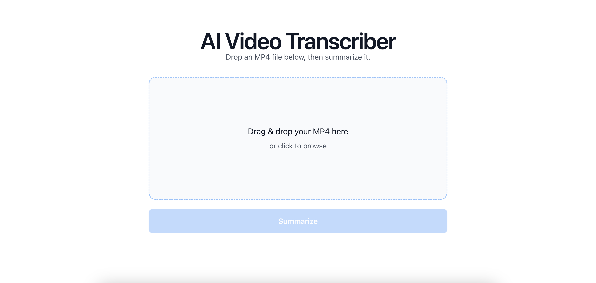

# AI Video Transcriber



Upload a video, transcribe it with Whisper, and summarize the result using any OpenAI-compatible LLM endpoint.

## Features

- Drag-and-drop MP4 upload in the browser
- Speech-to-text transcription powered by [Whisper](https://github.com/openai/whisper) via `faster-whisper`
- Text summarization through any OpenAI-compatible API (Ollama, OpenAI, vLLM, etc.)
- Customizable summarization behavior via `backend/system_prompt.txt`
- Chunked summarization for long transcripts

## Tech Stack

### Backend

- **Python 3.11+**
- **FastAPI** + **Uvicorn** — REST API
- **faster-whisper** — Whisper transcription
- **OpenAI Python SDK** — LLM summarization via compatible endpoints
- **ffmpeg** — audio extraction from video
- **uv** — dependency and environment management


### Frontend

- **React 19**
- **TypeScript**
- **Vite** — dev server and build tooling


## Project Structure

```
AI-Video-Transcriber/
├── backend/
│   ├── app.py              # FastAPI application
│   ├── transcriber.py      # Whisper transcription
│   ├── summarizer.py       # LLM summarization
│   ├── utils.py            # Audio extraction and chunking
│   ├── system_prompt.txt   # Prompt used for summarization
│   └── pyproject.toml
└── frontend/
    ├── src/App.tsx         # Upload UI
    └── vite.config.ts      # Dev proxy to backend
```


## Prerequisites

- [Python 3.11+](https://www.python.org/)
- [uv](https://docs.astral.sh/uv/)
- [Node.js](https://nodejs.org/) (for the frontend)
- [ffmpeg](https://ffmpeg.org/)
- An OpenAI-compatible LLM server (e.g. [Ollama](https://ollama.com/))


### Install ffmpeg (macOS)

```bash
brew install ffmpeg
```


### Install and run Ollama (example)

```bash
brew install ollama
ollama serve
ollama pull llama3.2:3b
```


## Configuration

Create `backend/.env` and paste:

```env
WHISPER_MODEL=base.en
LLM_BASE_URL=http://localhost:11434
LLM_MODEL=llama3.2:3b
LLM_API_KEY=ollama
SYSTEM_PROMPT=system_prompt.txt
```


| Variable        | Description                                                                      |
| --------------- | -------------------------------------------------------------------------------- |
| `WHISPER_MODEL` | Whisper model size (e.g. `base.en`, `small.en`, `medium.en`)                     |
| `LLM_BASE_URL`  | Base URL of an OpenAI-compatible API. `/v1` is appended automatically if missing |
| `LLM_MODEL`     | Model name on the LLM server                                                     |
| `LLM_API_KEY`   | API key (required by the SDK; Ollama accepts any value)                          |
| `SYSTEM_PROMPT` | Path to system prompt text file                                                  |

Notes: 
- any openAI compatible API can be used for summarization, feel free to change accordingly.
- LLM_API_KEY is required but ignored when using Ollama

## Customizing Summarization

Edit `backend/system_prompt.txt` to change how the LLM processes transcripts. The default prompt asks for a 2–3 sentence summary, but you can adapt it for cleaning, bullet points, action items, or any other output format.

The prompt is loaded at startup and sent as the system message for every summarization request.

## Running the Project

Run the backend and frontend in separate terminals.

### 1. Backend

```bash
cd backend
uv sync
uv run uvicorn app:app --reload --host 0.0.0.0 --port 8000
```

API docs: [http://localhost:8000/docs](http://localhost:8000/docs)

### 2. Frontend

```bash
cd frontend
npm install
npm run dev
```

App: [http://localhost:5173](http://localhost:5173)

During development, Vite proxies `/api` requests to the backend at `http://localhost:8000`.

## Usage

1. Open [http://localhost:5173](http://localhost:5173)
2. Drag and drop an MP4 file (or click to browse)
3. Click **Summarize**
4. Wait for processing to complete (longer videos can take several minutes)
5. Read the generated summary on the page


## API


### `GET /api/health`

Health check endpoint.

### `POST /api/process`

Upload a video for transcription and summarization.

**Request:** `multipart/form-data` with a `file` field (MP4)

**Query params:**

- `use_chunking` (default: `true`): summarize long transcripts in chunks

**Response:**

```json
{
  "transcript": "Full transcribed text...",
  "summary": "2-3 sentence summary..."
}
```


## How It Works

1. The frontend uploads an MP4 to `POST /api/process`
2. The backend extracts audio from the video with ffmpeg
3. Whisper transcribes the audio to text
4. The transcript is sent to the configured LLM using the system prompt
5. For long transcripts, text is chunked and summarized in stages
6. The transcript and summary are returned as JSON

